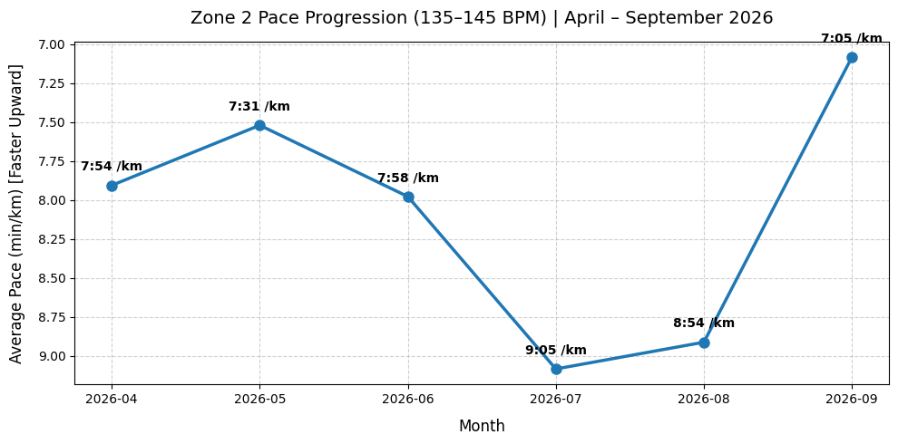

# 🏃 COROS Zone 2 Aerobic Progression Analysis

A Python-based data extraction, parsing, and analytical pipeline built to evaluate physiological aerobic adaptations from wearable Coros data over a 6-month marathon training block (April – September 2026). This is 1 month out from my first ever marathon, so I do expect there to be some marginal gains in aerobic fitness in the coming month, and will look to upload an updated version of this repository. 

---

## 📌 Project Overview
Rather than relying on the Coros platform itself, this pipeline ingests raw second-by-second `.fit` binary files exported from my COROS watch. By converting raw metrics into running pace and isolating heart rate strictly within Zone 2 bounds (135–145 bpm), the analysis demonstrates clear and measurable aerobic efficiency gains over time.

---

## 🛠️ Data Pipeline Architecture
1. **Raw Ingestion:** Extracted 60+ `.fit` binary activity files from a compressed ZIP archive.
2. **Parsing & ETL:** Utilized `fitparse` and `pandas` to translate binary streams into structured time-series DataFrames.
3. **Data Cleaning & Transformation:** 
   - Filtered out non-running and stationary seconds ($speed = 0$).
   - Converted raw speed ($m/s$) into running pace ($min/km$).
   - Removed GPS artifacts and pace outliers ($3.0 \le pace \le 15.0 \text{ min/km}$).
4. **Targeted Slicing:** Filtered data strictly within Zone 2 cardiac limits ($135 \le HR \le 145 \text{ bpm}$).
5. **Aggregation & Visualization:** Resampled metrics by calendar month and generated visualization plots using `matplotlib`.

---

## 📊 Key Analytical Findings
- **Baseline (April 2026):** Average Zone 2 Pace sat at **7:54 /km** across 4,158 logged seconds.
- **Mid-Block Drift (July–August 2026):** Average Zone 2 Pace spiked to **8:54 – 9:05 /km**, reflecting environmental cardiac drift (summer conditions) and higher overall volume. A few of these mid-block runs were done in Italy and Turkey, involving some quite hefty hills. Gradient, temperature, hydration and acclimitisation, therefore, are all factors I suspect affected this mid-block spike in pace.   
- **Adaptation Breakthrough (September 2026):** Average Zone 2 Pace dropped to **7:05 /km** across 9,845 logged seconds.
- **Aerobic Gain:** Achieved a **~49-second per kilometer pace improvement** at the exact same cardiac output (135–145 bpm).

---

## 📈 Zone 2 Progression Chart

---

## 💻 Tech Stack & Tools
- **Language:** Python 3.x
- **Environment:** Google Colab
- **Data Engineering:** `pandas`, `numpy`, `fitparse`, `zipfile`, `glob`, `os`
- **Visualization:** `matplotlib`
